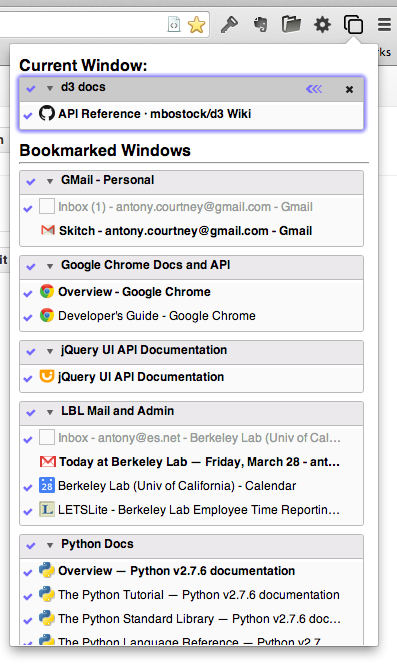
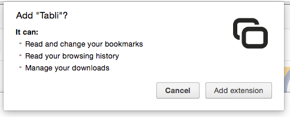

# Tabli

**Tabli** is an extension for Google Chrome that provides easy and fast switching between browser windows and tabs, even when you have dozens of windows and tabs open at once.

The core functionality of Tabli is an unobtrusive popup window (shown above) that provides a searchable, scrollable visual summary of the windows and tabs you currently have open. 

Tabli also supports saving and restoring named sets of tabs. This is useful for organizing and navigating reference documentation and other web sites you visit frequently.

Tabli has extensive [keyboard shortcuts](./tabli-usage.md), enabling you to quickly and efficiently navigate through your tabs in a few keystrokes without ever touching the mouse.

### How to Get It

Tabli is currently available as a pre-release to help me get feedback and identify bugs before
I do a broader public release.  *Please do not publicly post links or Tweets to this page or
the (unlisted) Chrome web store page for Tabli during this pre-release testing period.*

If you want access to this pre-release all I ask is that you join the tabli-users mailing list.
This will be an extremely low-volume list that I will use strictly for 
Tabli-related announcements. **I promise I will not use this list for any third party advertising and will not sell, share or disclose your email address to anyone.**  

**[Click here to subscribe to the tabli-users mailing list.](http://eepurl.com/bACAK1)**

You will receive a link to the (unlisted) Tabli install page on the Google Chrome Web Store immediately after your list subscription completes.

### How to Use Tabli

#### The Absolute Basics

- Click on the Tabli icon or use the keyboard shortcut (`Ctrl-.` by default) in any Chrome window to activate the popup.
- You can interactively search for a tab or window by typing a few characters (the Search box should have the default focus).
- You can use the up and down arrow keys (`↓` and `↑`) to navigate through the set of tabs or windows. Hold down `Ctrl` (`Ctrl-↓` and `Ctrl-↑`) to move by whole windows.
- Switch to a specific window or tab either by hitting `Enter` on a window or tab selected with the keyboard, or by clicking on any window or tab with the mouse.

For more advanced usage, see the [Usage Guide](./tabli-usage.md).

### How Much Will It Cost?

Tabli is free to install and use and the [source code is available](https://github.com/antonycourtney/tabli) under a permissive (MIT) license.  

### Privacy Concerns

When installing Tabli, you will see a somewhat scary looking confirmation dialog like this:

I take your privacy very seriously. Tabli uses these permissions to construct the tab switching dialog and enable you to save and restore tabs. **Tabli does not monitor or log your browsing behavior, make any outbound data connections or send any data whatsoever back to the developers or any third party or any other application or extension.**

### Keeping in Touch

You will receive an email address for feedback, questions and bug reports when you sign up for the mailing list. Please send feedback, questions and bug reports to that list.

If you are a developer, please feel free to also [browse the source and follow the project on github](https://github.com/antonycourtney/tabli).